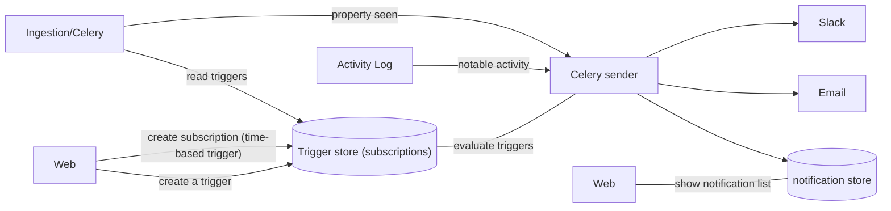

# Request for comments: Notifications & @pauldambra 

## Problem statement
*Who are we building for, what are their needs (include example cases), why is this important?*

Users don't know when to come back to PostHog. Something important can happen and they might miss it. This can be important things in the data, or that another user has edited your insight.

We could solve for this by extending the audit log. But you have to go check it to find new information. Where notifications can push important information directly to the user regardless of their context in the product. 

Additionally notifications can span multiple contexts, so they can communicate a broader range of information in very specific contexts. Audit logs are often specific to a single feature, so they only cover that scope.

Notifications can be split as active or passive. 

1. Active notifications are sent to you. 
2. Passive notifications are listed in the UI.

Or they can be split by urgency:

1. I want to know when something urgent has happened in slack / custom webhook so I can come to PostHog and investigate. 
2. I want to know what all has changed since I last logged in. These are in-app notifications about things I care about.

## Success criteria
*How do we know if this is successful (i.e. metrics, customer feedback), what's out of scope, whats makes this ambitious?*

We have users from [the August 2022 customer interviews](https://github.com/PostHog/posthog/issues/11368) that we can revisit.

We can measure:

* number of triggers created
* number of notifications sent
* stickiness of dashboards and insights

## Context
*What are our competitors doing, what are the technical constraints, what are customers asking for, what does the data tell us, are there external motivations (e.g. launch week, enterprise contract)?*

## Design 
*What are the key user experience and technical design decisions / trade-offs?*

The core here is re-using subscriptions infra to send notifications as well to slack, not only images?

And adds a store of notifications. These can be filtered to create the in-app notification view.

There are some designs in figma for comment https://www.figma.com/file/Y9G24U4r04nEjIDGIEGuKI/PostHog-Design-System-One?node-id=3112%3A1296

### user considerations

* how to create the triggers for notifications
* where to see configured triggers
* linking from notification to appropriate onward journey
* Scope - Users belong to organizations, organizations can have multiple projects, users can be at any level in the hierarchy at any given time - what's the appropriate scope of notifications based on what we know about the user? If the user is in a project, would we notify them of events from another project? Only a subset of users might get notifications about billing or org management level changes.
* Establishing what all justifies a notification. There's a really broad area to cover with our product, not all things will be of equal importance to a user, not all things are available depending on your plan / payment status / org role / etc.
* Nailing the preferences - getting enough configuration to cover the use cases discovered in interviews. This can be a really complex thing to figure out.
* expectation of performance
  * e.g. evaluate whether insight series have crossed a threshold could be very expensive
* when to send notifications? 
  * See "Complexity in whether to send a message" below
  * some users might want a particular trigger right away, others might want it in a roll-up email
    * do we allow that complexity
* where to show notifications?
  * if we have both an in-app notification center for passive/low-urgency notifications do we also show active/high-urgency notifications there

## Active/Urgent Notifications

Sent to slack or email

### Notifications people mentioned

* chart goes above or below a limit
    * expected to set this on an insight
* for a single event if the value of a property is over a threshold
* on particular calculated event
* notification when same event occurs for a single user/group over time (cohort entry/exit?)
* notification when experiment reaches significance

## In-App notifications

* what's new in PostHog https://github.com/PostHog/product-internal/pull/346
* new version of PostHog released https://github.com/PostHog/product-internal/pull/346
* all of the active notifications?

### Tech considerations

#### Complexity in whether to send a message

Whether to send a notification is not automatically straight-forward. There's [an internet famous example from Slack](https://d34u8crftukxnk.cloudfront.net/slackpress/prod/sites/7/0_PV_09olld6K1l8jQ.png). 

If you have configured a trigger to send a slack notification when a particular event is seen. Do you want 1000 notifications within a few seconds or minutes if you have a large burst of traffic? Or should we purposefully buffer notifications so we can roll-up notifications within a window?

#### Celery

Celery often struggles with load (at least as we have it configured). Subscriptions are a recurring celery task so it makes sense to start there.

But it may be better medium term to have a stream of notifications in kafka so we can completely separate the triggering of a notification from acting on it.

## Sprints
*How do we break this into discrete and valuable chunks for the folks shipping it? How do we ensure it's high quality and fast?*

There are several discrete chunks

* create the passive notification UI
* show someone a notification there when a subscription is sent (or fails)
* (use the activity log to) show someone a notification there when someone edits an insight, dashboard, or feature flag they created
* UI to set thresholds on graphs and to highlight when they are crossed
* ingestion creating a notification when event/property is seen
* ingestion creating a notification when property is seen with value over a threshold
* UI for creating event/property triggers
* cohort entry and exit triggers
* experiment status triggers

