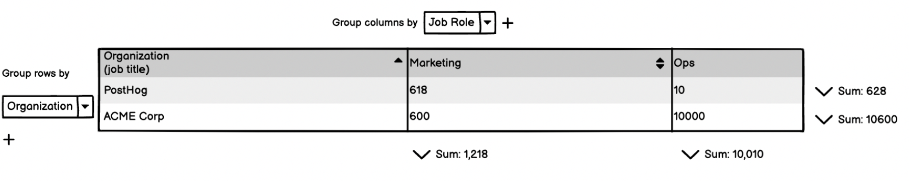
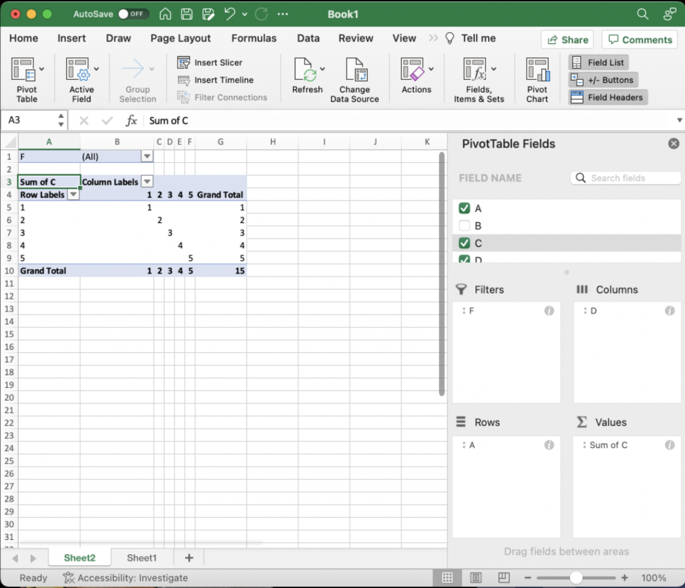

# Request for comments: Data exploration: Nail Data Tables + V2 of the Insights API - Marius Andra

## Summary

Problem 1 (The user's problem): PostHog is good for the creator (you know what you what insight you want to create) and consumer (viewing already made insights). But less so for the explorer (where the questions are higher level and more uncertain). For these questions you need to be able to "drill down" into the specific data and roll-up into more aggregated views.

Problem 2 (The engineering problem): Our API for querying insights has became very complex. It's slowing down our ability to iterate. Instead of extending our existing API we should be a more powerful V2 Insights API.
    - Why extend our API now rather than refactor later on? Many of the important feature requests will make the API even more complex. We should therefore refactor the API now before implementing the requested feature requests.

Proposed solution: **Nail Data Tables for exploration**.

This has two parts:

1. A single table which lets you flip between persons, events and recordings (need a better name, currently called Drill Down view OR Universal Search)
2. Pivot tables for viewing aggregate level statistics.

In order to Nail Data tables, we should also **create a V2 of the Insights API** which we will later refactor the other insights to use too.

The new V2 Insights API has several core advantages:

1. Can return data of different modalities
2. Common filter interface across insight types
3. Enables sorting
4. Breakdown of specific events

## What is Data Exploration?

*Feel free to skim read this part*

PostHog is a broad product solving a number of different Jobs to be done (JBTD) for a variety of users. Each job-to-be-done requires a different set of tools and has a different user behavior.

Example job-to-be-done (non-exhaustive list):

- Monitoring KPIs - how are the specific KPIs (product/team/company) doing? Are there any big changes, is everything going roughly in the right direction?
- Insights into a new feature you've built - I've created a new feature and I want to keep track of success metrics, view live events of people, and view session recordings of how people use it (Combines feature flags, trends, funnels and session recordings)
- Watching for errors and debugging - something went wrong (error gets trigger, visual regression, drop in conversion), getting told it went wrong, debugging it, shipping a solution and making sure that fixes it
- Conversion optimization - the growth team is monitoring how particular KPIs are doing, trying to come up with experiments, shipping features to try and improve these
- Answering product strategy questions - which customers should we focus on, what are our most used/valued features. e.g. should we increase the pricing from X to Y? Which customers should we focus on?

You can broadly group the job-to-be-done of Product Analytics in PostHog as:

- Creating: you know the view of the data that you are wanting to see **beforehand** and then you create the view. E.g. creating a dashboard to Monitor KPIs, or creating the funnel for your onboarding flow
- Consuming: you or someone else has made something in Posthog that you refer back to. E.g. Checking the dashboard you made to Monitor KPIs
- Exploring: you're answering a broader open-ended question. E.g. If you're monitoring your KPIs and you see something not right - you then want to dive into understanding why

Sometimes these different modes will be in the same session.

For this quarter we've decided to focus on the "Exploring" set of jobs-to-be-done as we believe we are currently under-serving users there. (For brevity I'm not going to go further into detail on this and the reasons why but I can if useful)

There are a number of exciting directions that we could go with Data Exploration. For example:

1. Making it easy to "drill down" = going from visualizations to the raw data.
   1. **Conversion dropping example**: you see there's a drop in sign up conversion this month. You click on dropped off users and starting manually browsing a few of their properties. You see lots of signups from Reddit and form a hypothesis that this this drop in conversion is caused by lower quality traffic.
2. Making it easy to "Roll up" = summarize the data
   1. **Continuing with the previous analogy:** You then create a table view to compare the sources of traffic for this month compared to last month by referral source. To do this you group the new sign ups by referral source and add a custom formula to calculate the conversion rate.
3. (Out of scope of this RFC) Making it easy to "Pivot between raw data and visualizations".
   1. **Continuing with the previous analogy** For example, given the table of data you then create a stacked bar chart showing the conversions by source for each month and see a decline in higher quality sources.
4. (Out of scope of this RFC) Making it easy to chain together different questions and answers + store working notes. Such as the "report" concept

## Let's Nail Data Tables

Summary for Nailing Data Tables:

- Problem we are solving:
  - High-level: answering more open-ended exploratory questions
  - Specific problem: being able to view and compare multiple aggregate statistics
- Proposed solution has two parts:
  - Creating a powerful table of specific events/persons/session recordings table (aka universal search)
  - Pivot tables
- Primary persona: Engineers and Technical PMs at 10-100 person post-PMF startups
- Secondary persona: Growth team analyzing conversion

Why should we enable users to do this:

1. (Luke's hypothesis based on personal experience) Currently we don't serve complex data exploration workflows that are often used by the power users of Posthog
2. Nailing data tables will solve many commonly requested smaller features:
   1. Table with multiple columns/metrics (aka ‘multiple breakdowns’): [https://github.com/PostHog/posthog/issues/11913](https://github.com/PostHog/posthog/issues/11913), [https://github.com/PostHog/posthog/issues/8454](https://github.com/PostHog/posthog/issues/8454), [https://github.com/PostHog/posthog/issues/938](https://github.com/PostHog/posthog/issues/938)
   2. Allow showing person/group properties as columns under live events: [https://github.com/PostHog/posthog/issues/11861](https://github.com/PostHog/posthog/issues/11861)
   3. Default sort order for tables (on dashboards): [https://github.com/PostHog/posthog/issues/10562](https://github.com/PostHog/posthog/issues/10562)
   4. Sort multiple columns in table: [https://github.com/PostHog/posthog/issues/12167](https://github.com/PostHog/posthog/issues/12167)
   5. Aggregation based on persons properties
   - Joe from MentionMe: It would be great to have non-event insights - example: Percentage of all users who have property X, How many groups have property Y, Currently (unless I’m mistaken), it requires an event to do this? There’s no way to get these arbitrary (but fairly simple) counts from PostHog data?
   - Count of items in a filtered list: [https://github.com/PostHog/posthog/issues/10410](https://github.com/PostHog/posthog/issues/10410)
3. *Bonus but important given the context of this RFC* By creating the API needed for complex data tables we'll also unlock a more general API for insights

## Drill down view - Raw events/persons/recordings table

Marius has done a good job getting started with this: https://github.com/PostHog/posthog/pull/11981

This would replace the modal when you click on a part of a visualization or a cell in a Pivot Table. It would show you the raw events/persons/recordings. And importantly you can view the specific filters and edit them as you'd like


## Pivot table example

Pivot table requirements:

1. Multiple sort by columns i.e. sort by org name then by email address
2. 2D view of data (not just event on the left, time on the top axis)
3. Group bys (same thing as breakdowns) (on both axis)
4. Value aggregation
5. Column containing custom formula
6. Click on aggregate value to view the raw data

Here's what the pivot table might look like:



For extra context here is what the [Google Sheets Pivot Table](./2022-11-02-data-exploration/google-sheet-pivot-table.png) looks like and the Excel Pivot Table .

Loom workflow of how they tie together: https://www.loom.com/share/4658a6fd575c49c982a6b2741daec8d0

## Problems with the current insights API details

We capture a stream of events with all sorts of properties:

```js
// this is pseudocode, only for illustration
event = {
    event: 'event name',
    distinct_id: 'unique id',
    ip: '127.0.0.1',
    timestamp: string,
    properties: {
        $withdollar: 'posthog properties',
        '$feature/stuff': 'feature flags',
        'anything else': 'custom properties',
    },
    person: { properties: {} },
    group1: { properties: {} },
}
```

We store this stream of events in a table in ClickHouse, and let users analyse it with bespoke tools like "trends", "retention", "persons" or "live events".

For example, you can:

- Through "live events"
  - List all latest events and show their properties
  - Filter this list by any event, person, or group property
  - Filter this list by event name, person_id, distinct_id, group ids
  - Select custom properties to fetch
- Through an "insight"
  - Aggregate these event lists into time buckets (number of events per day)
  - Support this data with aggregate math (`count(distinct distinct_id)`, `count(*)`, `avg(count(unique property))`)
  - Combine multiple columns with formulas
  - Breakdown by properties (`$browser`)
  - Manipulate these events further with custom queries to generate bespoke graphs (`funnel`, `retention`, `paths`)
- Through the insight persons modal
  - Remove the aggregation (e.g. remove the count by day, and focus on the events of one day)
  - Get the actual persons behind the list.
  - On a funnel, get the success/dropoff for each step.
- Through persons/cohorts
  - Show people who have done various events any number of times
  - Show people whose properties match certain values

All these tools operate by passing to various API endpoints a HUGE object of type `FilterType`:

```ts
export interface FilterType {
    insight?: InsightType
    display?: ChartDisplayType
    interval?: IntervalType

    // Specifies that we want to smooth the aggregation over the specified
    // number of intervals, e.g. for a day interval, we may want to smooth over
    // 7 days to remove weekly variation. Smoothing is performed as a moving average.
    smoothing_intervals?: number
    date_from?: string | null
    date_to?: string | null
    properties?: AnyPropertyFilter[] | PropertyGroupFilter
    events?: Record<string, any>[]
    event?: string // specify one event
    actions?: Record<string, any>[]
    breakdown_type?: BreakdownType | null
    breakdown?: BreakdownKeyType
    breakdowns?: Breakdown[]
    breakdown_value?: string | number
    breakdown_group_type_index?: number | null
    shown_as?: ShownAsValue
    session?: string
    period?: string

    retention_type?: RetentionType
    retention_reference?: 'total' | 'previous' // retention wrt cohort size or previous period
    total_intervals?: number // retention total intervals
    new_entity?: Record<string, any>[]
    returning_entity?: Record<string, any>
    target_entity?: Record<string, any>
    path_type?: PathType
    include_event_types?: PathType[]
    start_point?: string
    end_point?: string
    path_groupings?: string[]
    stickiness_days?: number
    type?: EntityType
    entity_id?: string | number
    entity_type?: EntityType
    entity_math?: string
    people_day?: any
    people_action?: any
    formula?: any
    filter_test_accounts?: boolean
    from_dashboard?: boolean | number
    layout?: FunnelLayout // used only for funnels
    funnel_step?: number
    entrance_period_start?: string // this and drop_off is used for funnels time conversion date for the persons modal
    drop_off?: boolean
    funnel_viz_type?: FunnelVizType // parameter sent to funnels API for time conversion code path
    funnel_from_step?: number // used in time to convert: initial step index to compute time to convert
    funnel_to_step?: number // used in time to convert: ending step index to compute time to convert
    funnel_step_breakdown?: string | number[] | number | null // used in steps breakdown: persons modal
    compare?: boolean
    bin_count?: BinCountValue // used in time to convert: number of bins to show in histogram
    funnel_window_interval_unit?: FunnelConversionWindowTimeUnit // minutes, days, weeks, etc. for conversion window
    funnel_window_interval?: number | undefined // length of conversion window
    funnel_order_type?: StepOrderValue
    exclusions?: FunnelStepRangeEntityFilter[] // used in funnel exclusion filters
    exclude_events?: string[] // Paths Exclusion type
    step_limit?: number // Paths Step Limit
    path_start_key?: string // Paths People Start Key
    path_end_key?: string // Paths People End Key
    path_dropoff_key?: string // Paths People Dropoff Key
    path_replacements?: boolean
    local_path_cleaning_filters?: Record<string, any>[]
    funnel_filter?: Record<string, any> // Funnel Filter used in Paths
    funnel_paths?: FunnelPathType
    edge_limit?: number | undefined // Paths edge limit
    min_edge_weight?: number | undefined // Paths
    max_edge_weight?: number | undefined // Paths
    funnel_correlation_person_entity?: Record<string, any> // Funnel Correlation Persons Filter
    funnel_correlation_person_converted?: 'true' | 'false' // Funnel Correlation Persons Converted - success or failure counts
    funnel_custom_steps?: number[] // used to provide custom steps for which to get people in a funnel - primarily for correlation use
    aggregation_group_type_index?: number | undefined // Groups aggregation
    funnel_advanced?: boolean // used to toggle advanced options on or off
    show_legend?: boolean // used to show/hide legend next to insights graph
    hidden_legend_keys?: Record<string, boolean | undefined> // used to toggle visibilities in table and legend
    breakdown_attribution_type?: BreakdownAttributionType // funnels breakdown attribution type
    breakdown_attribution_value?: number // funnels breakdown attribution specific step value
    breakdown_histogram_bin_count?: number // trends breakdown histogram bin count
    aggregation_axis_format?: AggregationAxisFormat // a fixed format like duration that needs calculation
    aggregation_axis_prefix?: string // a prefix to add to the aggregation axis e.g. £
    aggregation_axis_postfix?: string // a postfix to add to the aggregation axis e.g. %
}
```

This `FilterType` has been "append-only" since 2020, and has passed the point of maintainability.

First some examples, then a proposal for a new approach.

### Filter examples

Here's a filter that returns a "trends" insight showing the aggregate count of events of type `$pageview` for the last 14 days:

```json
{
    "insight": "TRENDS",
    "interval": "day",
    "display": "ActionsLineGraph",
    "actions": [],
    "events": [
        {
            "id": "$pageview",
            "name": "$pageview",
            "type": "events",
            "order": 0
        }
    ],
    "properties": [],
    "filter_test_accounts": false,
    "date_from": "-14d",
    "date_to": null
}
```

Here's a funnel `event $pageview -> event $pageview with filters -> action "definitely not an action"`. The second event has a few filters applied.

```json
{
    "insight": "FUNNELS",
    "date_from": "-14d",
    "actions": [
        {
            "id": "2",
            "type": "actions",
            "order": 2,
            "name": "definitely not an action"
        }
    ],
    "events": [
        {
            "id": "$pageview",
            "name": "$pageview",
            "type": "events",
            "order": 0,
            "custom_name": "Visited a page"
        },
        {
            "id": "viewed dashboard",
            "type": "events",
            "order": 1,
            "name": "viewed dashboard",
            "properties": [
                {
                    "key": "created_at",
                    "value": "2022-11-14",
                    "operator": "is_date_exact",
                    "type": "group",
                    "group_type_index": 1
                },
                {
                    "key": "$browser",
                    "value": ["Chrome"],
                    "operator": "exact",
                    "type": "event"
                },
                {
                    "key": "email_opt_in",
                    "value": ["true"],
                    "operator": "exact",
                    "type": "person"
                }
            ]
        }
    ],
    "display": "FunnelViz",
    "new_entity": [],
    "interval": "day",
    "properties": [],
    "funnel_viz_type": "steps",
    "exclusions": []
}
```

That's a funnel. If I open its "step 2 dropoff", the filter gets two extra fields, and the API endpoint is different (`/insights/funnel` vs `/person/funnel`):

```json
{
    "funnel_step_breakdown": [""],
    "funnel_step": -2
}
```

Here's a path with a global filter:

```json
{
    "insight": "PATHS",
    "properties": {
        "type": "AND",
        "values": [
            {
                "type": "AND",
                "values": [
                    {
                        "key": "$anon_distinct_id",
                        "value": "e",
                        "operator": "not_icontains",
                        "type": "event"
                    }
                ]
            }
        ]
    },
    "end_point": "http://amazingstore.com/cart",
    "step_limit": 8,
    "include_event_types": ["$pageview"],
    "path_groupings": [],
    "exclude_events": [],
    "date_from": "-14d",
    "date_to": null,
    "funnel_filter": {
        "date_from": "-14d"
    },
    "local_path_cleaning_filters": []
}
```

Moving away from insights, here's a query under cohorts for "match persons who match criteria: completed `$autocapture` exactly 5 times in the last 30 days"

```json
{
    "properties": {
        "type": "OR",
        "values": [
            {
                "type": "OR",
                "values": [
                    {
                        "key": "$autocapture",
                        "type": "behavioral",
                        "value": "performed_event_multiple",
                        "negation": false,
                        "operator": "exact",
                        "event_type": "events",
                        "time_value": "30",
                        "time_interval": "day",
                        "operator_value": 5
                    }
                ]
            }
        ]
    }
}
```

## Proposal: PostHog Query AST

TODO: *Create a spec of what the API should look like*
TODO: *Likely don't have the operation as a key and instead as a value*

```json
{
    "type": "funnel",
    "steps": [
        {
            "type": "events"
        },
        {
            "type": "events",
            "filters": {
                "event": "$pageview",
                "properties": [{ "key": "$browser", "equals": "Chrome" }]
            }
        }
    ],
    "breakdown": ["event[0].$browser"]
}
```

Instead of a bespoke and scary monolithic filter object, I propose to split this up into **nestable typed query objects**.

The end result should pass as an AST - an Abstract Syntax Tree ([here's an example TypeScript AST](https://ts-ast-viewer.com/#code/GYVwdgxgLglg9mABBAFjCBrApkgFASkQG8AoRZBAZzgBssA6GuAc1wHIUsanEB3OAE40AJm3wkAvkA)).

An AST is an abstraction, and with some effort and clever tree parsing, we can convert it **to and from** any other query language. Think `HogQL` --> `AST` (this RFC) --> `Clickhouse SQL` or `BigQuery SQL`.

This RFC is only scoped to the `AST` --> `ClickHouse SQL` transformation and does not worry about `HogQL` input nor `BigQuery` output. Those are for the future, if at all.

### Examples

*Note: These examples are illustrative, and possibly not coherent at a query level. The final shapes will be determined when actual work starts.*

#### Events example

Let's start with the simplest query that returns all events:

```json
{
    "type": "events"
}
```

```ts
interface Node {
    type: string
}
```

#### Events with filters

Adding a few filters

```json
{
    "type": "events",
    "filters": {
        "event": "$pageview",
        "properties": [{ "key": "$browser", "equals": "Chrome" }],
        "date_from": "-14d",
        "date_to": null
    }
}
```

```ts
interface EventsNode extends Node {
    type: 'events'
    filters: EventFilters
}
```

This query can be used as input wherever an `EventsNode` is expected.

#### Funnel example

Sample insight with 2 steps, both of type `EventsNode`.

```json
{
    "type": "funnel",
    "steps": [
        {
            "type": "events"
        },
        {
            "type": "events",
            "filters": {
                "event": "$pageview",
                "properties": [{ "key": "$browser", "equals": "Chrome" }]
            }
        }
    ]
}
```

```ts
interface FunnelNode extends Node {
    type: 'funnel'
    steps: EventsNode[]
}
```

It's exactly the same type, no confusion.

#### Funnel dropoff persons

If we want people who dropped off at a step, broken down further, it'd be something like:

```json
{
    "type": "persons",
    "breakdown": ["person.account_type"],
    "from": {
        "type": "funnel-dropoff",
        "step": "2",
        "from": {
            "type": "funnels",
            "steps": [
                {
                    "type": "events"
                },
                {
                    "type": "events",
                    "filters": {
                        "event": "$pageview",
                        "properties": [
                            {
                                "key": "$browser",
                                "equals": "Chrome"
                            }
                        ]
                    }
                }
            ]
        }
    }
}
```

```ts
interface PersonsNode extends Node {
    type: 'persons'
    breakdown?: string[]
    from?: FunnelDropoffNode | EventsNode
}

interface FunnelDropoffNode extends Node {
    type: 'funnel-dropoff'
    step: number
    from: FunnelNode
}
```

I'm not sure how many levels of abstractions this requires. It'll depend on how this maps to actual SQL.

#### Funnel correlation

You could get correlation analysis for a funnel in a similar way:

```json
{
    "type": "correlation",
    "correlation": {
        "type": "properties",
        "exclude_names": ["$initial_geoip_postal_code", "$initial_geoip_latitude", "$initial_geoip_longitude"],
        "names": ["$all"]
    },
    "from": {
        "type": "funnels",
        "steps": [
            {
                "type": "events"
            },
            {
                "type": "events",
                "filters": {
                    "event": "$pageview",
                    "properties": [{ "key": "$browser", "equals": "Chrome" }]
                }
            }
        ]
    }
}
```

```ts
interface CorrelationNode extends Node {
    type: 'correlation'
    correlation?: CorrelationOptions
    from?: FunnelNode
}
```

### API endpoint

*Luke todo: need to investigate this further - I think the return object should either be events/persons/sessions?*

Proposed endpoint: `https://app.posthog.com/api/projects/:team_id/query`

The request will be a valid JSON **data node** from any of the queries above. Requesting a visualization node will result in an error.

The response for a query of type `events` will be something like this:

```ts
interface EventsResponse {
    type: 'events'
    query: EventsNode
    count: number
    results: EventsResult[]
}
```

### Performance

The funnel query above can be summarised as `persons.from --> funnel_dropoff.from --> funnels.steps[] -> events`

This feels like it'll be 4 subqueries inside each other. Something like:

```sql
select sum(...)
from (
  select some_cols from (
     select * from events where time filter
  )
  where another_filter
  group by something
)
group by foobar
```

In reality, that's the answer sometimes. Most times we'd like to "unwrap" this and run a more performant query instead:

```sql
select sum(...) from events where time filter group by foobar
```

There are many ways to keep this performant. For example an optimization pass on the AST that merges nodes into faster composed nodes. `funnels.steps[] -> events` becomes `funnels.steps_from_events[]`.

Yet such an optimisation step is overkill at this stage. The easiest solution is to just peek inside the inputs when parsing them.

That basically means, instead of

```ts
function parseFunnelDropoff(node: FunnelDropoffNode, ctx: QueryContext) {
    const sql = ctx.wrap(opts.from)
    return `query something (${sql}) step ${ctx.wrap(step)} power to the people`
}
function parseFunnel(node: FunnelDropoffNode, ctx: QueryContext) {
    const sql = ctx.wrap(opts.steps.map((step) => `(${ctx.wrap(opts.step)})`))
    return `make funnel from (${sql}) get stuff`
}
```

you write

```ts
function parseFunnelDropoff(node: FunnelDropoffNode, ctx: QueryContext) {
    const sql = ctx.wrap(opts.from.steps.map((step) => `(${ctx.wrap(opts.step)})`))
    return `query something (${sql}) step ${ctx.wrap(step)} do other stuff`
}
```

### Tree parsing

I don't know what's the right shape for the parser. I don't know if this should be a bunch of functions, or classes. I do however know we need to pass around a global `ctx` object

```ts
// either this
class FunnelDropoffNode extends Node {
    toSQL({ wrap, ctx, opts }) {
        // opts.from is FunnelNode
        return `query something (${wrap(opts.from, ctx)}) step ${wrap(step, ctx)} do other stuff`
    }
}

// or this
function parseFunnelDropoff(node: FunnelDropoffNode, ctx: QueryContext) {
    const sql = ctx.wrap(opts.from)
    return `query something (${sql}) step ${ctx.wrap(step)} power to the people`
}
```

This `ctx` could be used to carry global filters to the end, e.g. from `funnel` to the `events` themselves.

```ts
function parseFunnel(node: FunnelDropoffNode, ctx: QueryContext) {
    ctx.filters = [...ctx.filters, ...node.globalFilters]
    const sql = ctx.wrap(opts.steps.map((step) => `(${ctx.wrap(opts.step)})`))
    return `make funnel from (${sql}) get stuff`
}
```

This section requires a deeper dive, possibly during implementation.

### Multiple levels

As long as somewhere in the chain we have something that normalises to either `persons` or `events`, we're golden. These should be the common targets, that can act as input to a lot of queries and visualizations. Each level in this chain will require a subquery.

### Pagination

TODO

### Versioning

TODO. We will possibly need an `apiVersion` field in each AST node.

## Next steps for the backend

Focus first on getting it working for Data Tables

This is a gradual rollout. There will be no big rewrite. The steps below will also bring no visible changes on the frontend.

1. Refactor the huge `FilterType` into `InsightTrendsFilter`, `InsightFunnelsFilter`, etc. It's still the same backend, just with cleaner queries (e.g. remove all `funnel*` fields for the trends filter).
2. Create flat query nodes like `insightTrendsQuery`, `insightPathsQuery`, and document their structure.
3. Create a "backend router". This will be one endpoint, which takes a query object, and returns the matching results. For now, we will just pass these queries on to the existing insight queries.
4. Create a new query node type `"events"`, with support for various filters. Use this to power the "live events" page.
5. Replace the bespoke steps in `insightTrendsQuery`, `insightFunnelQuery`, etc with nodes of type `events`.

The next steps after these will be determined when we work on this. However, these are some options:

1. Create a new node type `persons`, and connect it to the existing persons/cohorts/etc tables.
2. Create a new node type `persons from events`, something like: `{ type: 'persons', from: { query: { type: 'insightTrends', ... } } }`, where you get a list of persons for any events query.
3. Refactor the person modals to use this new query.

## Appendix

### Frontend types of Nodes

*Luke: this seems important but separate to the Insights API and the Data Exploration?*

There are two types of AST nodes: 1) Data nodes, 2) Visualization nodes.

Here's a visualization node `barTimeGraph`, which has a data node of type `events` as its source.

```json
{
    "type": "barTimeGraph",
    "options": {
        "legend": false,
        "xAxisLabel": "klingons",
        "xAxisUnit": "kg"
    },
    "source": {
        "type": "events",
        "filter": { "date_from": "-7d" },
        "breakdown": "event.properties.$browser",
        "interval": "day"
    }
}
```

Here's the same data powering an events table

```json
{
    "type": "eventsTable",
    "options": {
        "columns": [
            "timestamp",
            "event",
            "person",
            "properties.$browser",
            "person.properties.$initial_browser",
            "formula:(properties.$screen_width * properties.$screen_height)"
        ]
    },
    "source": {
        "type": "events",
        "filter": { "date_from": "-7d" },
        "breakdown": "event.properties.$browser",
        "interval": "day"
    }
}
```

## Future directions

Here even more ways to take this further.

### "Query Apps"

We could build various apps that modify the query, like you'd modify an AST.

```json
{
    "type": "funnels",
    "steps": [
        {
            "type": "action",
            "action": {
                "id": 1
            }
        },
        {
            "type": "events",
            "filters": {
                "event": "$pageview",
                "properties": [
                    {
                        "key": "$browser",
                        "equals": "Chrome"
                    }
                ]
            }
        }
    ]
}
```

A hypothetical "action inliner" app could convert the `{ type: 'action' }` node into a corresponding `{ type: 'events', filters: {} }` node.

### "Visualization apps"

Custom JS apps that get data and show it in many new formats. World map 2.0.

### HogQL

An AST can be converted into any language.

For example this:

```json
{
    "type": "funnel",
    "steps": [
        {
            "type": "events"
        },
        {
            "type": "events",
            "filters": {
                "event": "$pageview",
                "properties": [{ "key": "$browser", "equals": "Chrome" }]
            }
        }
    ],
    "breakdown": ["event[0].$browser"]
}
```

could be equivalent to this:

```sql
SELECT * FROM funnel WITH STEPS (SELECT * FROM events) as events1, (SELECT * FROM events WHERE event='$pageview' AND properties.$browser = 'Chrome') as events2 BREAKDOWN BY events1.properties.$browser
```

If it's better, I don't know. Probably just more error prone.

Other frontend directions that we could go

### Phase 1 - keeping up with the refactors

The changes above will require a lot of frontend refactors. To keep this manageable, we will not introduce (almost?) any new frontend functionality in the first phase. We will refactor the frontend to support the new queries as they are implemented.

Some new things that could be included:

- You can now put all different tables and parts of insights (e.g. correlation analysis) onto a dashboard
- Same with event tables and the like

### Phase 2 - new live events table

Combining work from the [Lemon Data Grid](https://github.com/PostHog/posthog/pull/11817), build and release a new events table. Add configurable person properties.

### Phase 3 - live events aggregrations

Finally a big new feature: add support for aggregating values in the events view.

Useful for debugging
Less important about stuff being live
More about raw view of events and then being able to pivot/aggregate the data

### Phase 4 - non-event visualizations

Make visualizations like `pieChart` accept different mappable inputs, so it could be used to render any type of data.

new API would return persons or events

### Phase 5 - escape the persons modal

Add an "explore further" button to break out of the persons modal. This would effectively load a new data table (think persons list), but with certain filters applied.

person view of the pivot table

### Phase 6 - start converging things

- Implement universal search. [MVP](https://github.com/PostHog/posthog/pull/11981)
- Introduce a big search bar that lets you swoop between different views. (maybe two selects at first?)
- Easily switch between events, persons, filters, etc.
- We could store a lot of stuff in the URL now, including frontend filters: `app.posthog.com/query#q={big-json-object}`

### Phase 7 - implement more things

- Add grouping, breakdowns, formulas and person properties to the "events" and "persons" pages.
- Make a nifty query editor that knows what to suggest. Perhaps use this to build the edit interface?
- ???

## Luke's todos

**TODO**: Merge cohort filter and event filters
