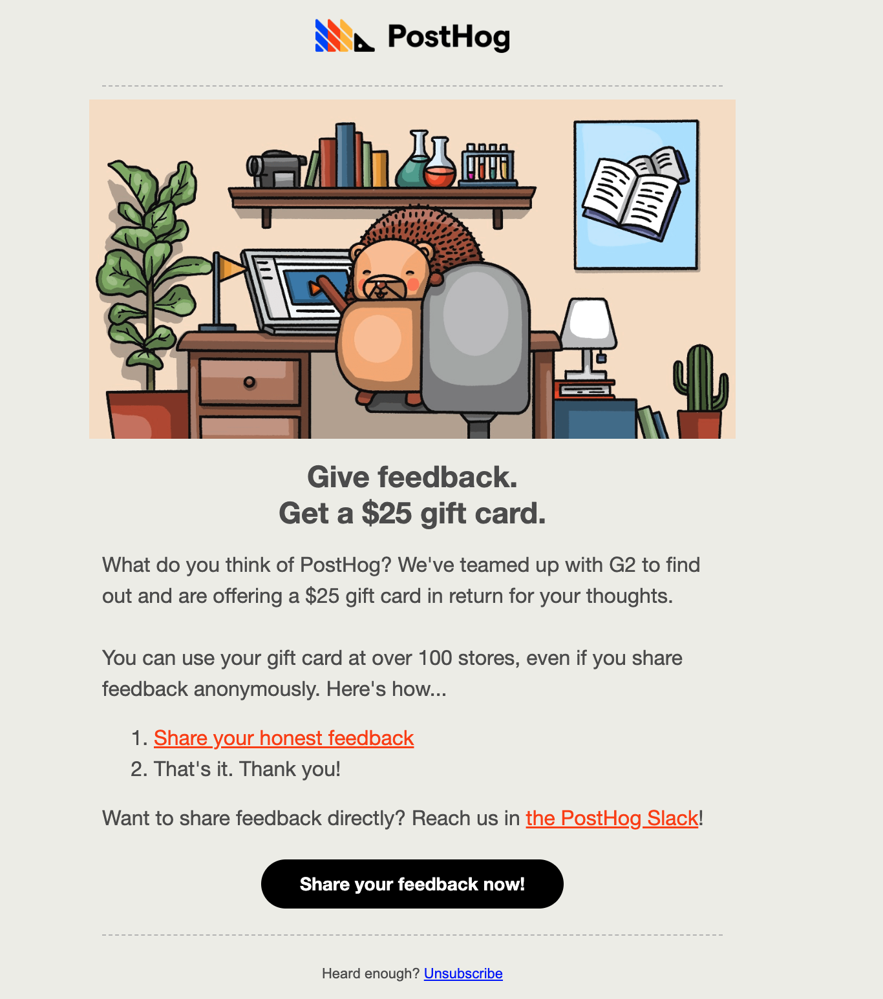

# Request for Comments: G2 Automation

- **Created:** 2023-01-11
- **Owner:** @joethreepwood
- **GitHub issues:** 

> While commenting on this, please comment on specific lines if possible, to thread the discussion.

## Overview

I've successfully automated the collection of G2 reviews in Slack, for us and our competitors. 

Next, we should automate G2 review requests themselves. This will save time, effort, sanity. By following the proposal it will also enable better tracking, so we can create experiments to optimize the process. 

## Background
We've started to get decent traction with G2. 

Currently, we encourage reviews by emailing users once and asking them to review us on G2. We target users based on the following criteria:

- User has signed up in the last 30 days
AND
- User has completed the `discovery` action in the last 30 days

Each month, I manually create a cohort in PostHog based on this, export it, clean the data manually, import it to Mailchimp and send it. It's not a world-ending task, but it is a manual one.

The email offers a $25 gift card in return for a review. Moderation of reviews and delivery of these cards is automated on G2's platform. 

We've experimented with various targeting methods, email copies and incentives and this process works well, but it's based on a manual comparison of results. The manual Mailchimp process doesn't allow for more sophisticated experiments or comparison.

And we're now moving away from Mailchimp anyway.

### Proposal

I've prepared, in Customer.io, a new process which will automate the entire process and turn it into an on-going delivery, rather than a batched send. This process is ready to go, so this RFC is a chance for final tweaks, thoughts, and approval. 

The new process will use Customer.io segments and workflows to automatically send the same email we currently use. 

Customer.io doesn't ingest actions (which `discovery` is), so we'll use the following criteria:

- User has completed the `insight analyzed` event at least 3 times in the last 30 days
OR
- User has completed the `recording analyzed` event at least 3 times in the last 30 days
OR
- User has completed the `feature flag created` event at least 1 time in the last 30 days
OR
- User has completed the `experiment launched` event at least 1 time in the last 30 days

When a user matches this criteria they are added to a new `G2 Review Requests` Segment. 

When a user enters this segment, they immediately join a new `G2 Review Requester` campaign which enters them into a workflow _if they also match the following criteria_:

- User is in segment `Valid Email Address` (used to check we can send an email)
AND
- User is _not_ in segment `Historic G2 Segment` (a list of people who have been manually asked previously)

In this way, with additional campaign options, we should be targeting users who:

1. Have actually used PostHog in some sort of meaningful way
1. Have not been asked for a review before
1. Have not unsubscribed from emails
1. Have a valid email address

Users are also prevented from receiving the email multiple times, in case they somehow exit and re-enter the segment. 

### Workflow

Once someone enters the segment, they are added to the campaign immediately. We then add a 2 day time delay, to help avoid too much overlap with any onboarding emails for new users. 

They then receive the following email, which is sent automatically from `hey@posthog.com`. 

After this, they exit the campaign, but remain in the segment. 

### Benefits & Drawbacks

In addition to saving time and effort for the Marketing team (as well as the creeping chance for human error), Customer.io offers several benefits. We will be able to run A/B experiments within the workflow to further test changes and will have a single read on the CTR. 

The main drawback is that we'll have to monitor CTR as the success criteria, rather than submitted reviews. However this was also an issue for Mailchimp, and seems unsolvable from conversations with G2. 
