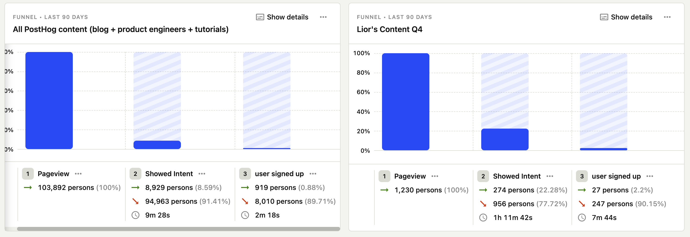
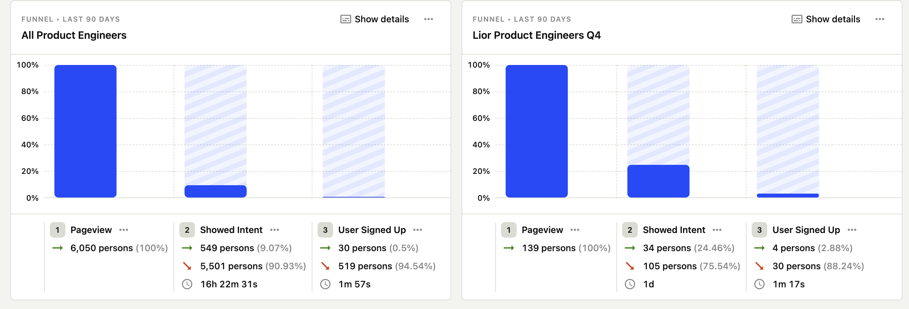
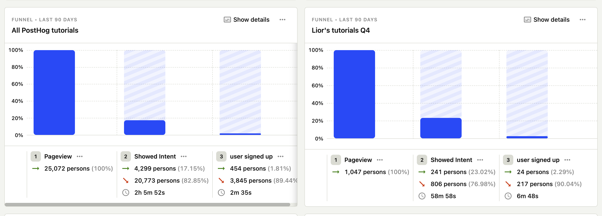

# Request for comments: Results on content written by Lior in 2023 Q4

This last quarter I wrote a mix of content focusing on [A/B testing and surveys](https://github.com/PostHog/posthog.com/issues/7141). This RFC is to share the results of how it performed to better inform our content strategy.

> Note: These are only preliminary results. Some of the content is still new and was published less than 30 days ago. I plan to update these results at the end of January, and then again before 2024 Q2 planning. 
> 
> Since numbers are still low, take these results with a pinch of salt.

## TLDR

Tutorials rank higher on Google than blog posts, and get more unique visitors. They're also easier to write. This validates the strategy for [Megaissue 2024Q1 - Tutorials for all our key frameworks and products](https://github.com/PostHog/posthog.com/issues/7310) 

## Results

[Dashboard with the results](https://us.posthog.com/dashboard/119652)

Below is a table with the individual results for each post, sorted by number of unique visitors in the last 30 days:

| URL | Ahrefs Keyword | Ahrefs Vol | Ahrefs KD | Ahrefs SERP Ranking | Actual Unique Visitors (30d) |
| --- | -------------- | ---------- | --------- | ------------ | ---------------------- |
| [Analyze Surveys with ChatGPT](https://posthog.com/tutorials/analyze-surveys-with-chatgpt) | How to analyze surveys | 60 | 24 | 74 | 205 |
| [Framer AB Tests](https://posthog.com/tutorials/framer-ab-tests) | framer ab tests | 0 | 0 | 2 | 125 |
| [Nextjs Surveys](https://posthog.com/tutorials/nextjs-surveys) | Nextjs surveys | 0 | 0 | 1 | 117 |
| [React Surveys](https://posthog.com/tutorials/react-surveys) | React surveys | 0 | 15 | 4 | 112 |
| [iOS AB Tests](https://posthog.com/tutorials/ios-ab-tests) | ios ab tests | 0 | 13 | 15 | 51 |
| [Best Mobile App AB Testing Tools](https://posthog.com/blog/best-mobile-app-ab-testing-tools) | mobile app ab testing platform | 40 | 12 | 18 | 50 |
| [Webflow Surveys](https://posthog.com/tutorials/webflow-surveys) | Webflow surveys | 0 | 0 | 8 | 48 |
| [Nuxtjs AB Tests](https://posthog.com/tutorials/nuxtjs-ab-tests) | Webflow surveys | 0 | 0 | 3 | 47 |
| [Multivariate Testing Example](https://posthog.com/product-engineers/what-is-multivariate-testing-examples) | multivariate testing example | 40 | 38 | 20 | 45 |
| [Android AB Tests](https://posthog.com/tutorials/android-ab-tests) | android ab tests | 30 | 24 | 38 | 44 |
| [How to Create User Personas](https://posthog.com/product-engineers/how-to-create-user-personas) | how to create user personas | 90 | 48 | 48 | 43 |
| [Framer Surveys](https://posthog.com/tutorials/framer-surveys) | framer surveys | 0 | 0 | 3 | 39 |
| [NPS vs CSAT vs CES](https://posthog.com/tutorials/nps-vs-csat-vs-ces) | nps vs csat | 500 | 5 | 63 | 39 |
| [Vue AB Tests](https://posthog.com/tutorials/vue-ab-tests) | vue ab tests | 0 | 0 | 3 | 30 |
| [In-depth: PostHog vs Statsig](https://posthog.com/blog/posthog-vs-statsig) | posthog vs statsig | 0 | 0 | 1 | 30 |

In total:
- Tutorials had 723 unique visitors.
- Blog + product engineer posts had 189 unique vistors.

Key takeaways:
- Tutorials rank higher than blog posts. This makes sense as they're much less competitive.
- We can expect to get more volume for all our posts than Ahrefs estimates, even if we don't rank on the first page.
- Ahrefs volume is very inaccurate for framework searches. It usually says 0, although the actual visitors can reach more than 100.
  
## Comparing Lior's content vs existing PostHog content

I compared the funnels from `Pageview -> Showed intent -> Conversion` of my content vs all our content. Here's a table summary (or see images below):

|  | Existing content – Showed Intent | Lior's content – Showed Intent | | Existing content – User Signed up | Lior's content – User Signed up* |
| --- | -------------- | ---------- | 
| All content    |     8.57%    |    22.24%    | 0.88%  | 2.19% |
| Product engineers content | 9.07%  | 24.46% | 0.5% | 2.88% |
| Tutorials | 17.14% | 22.97% | 1.8% | 2.29% |

* Keep in mind that for conversion rate on Lior's content the numbers are low, so they are likely to fluctuate over time.

It was good to see that my content had a higher intent and signup rate than our existing content. My takeaway from this is that the type of content I wrote is what our target audience wants to read.

