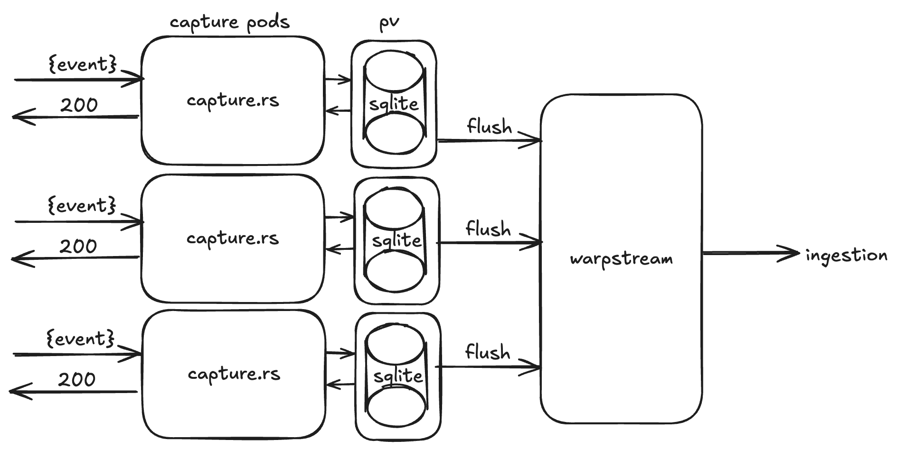
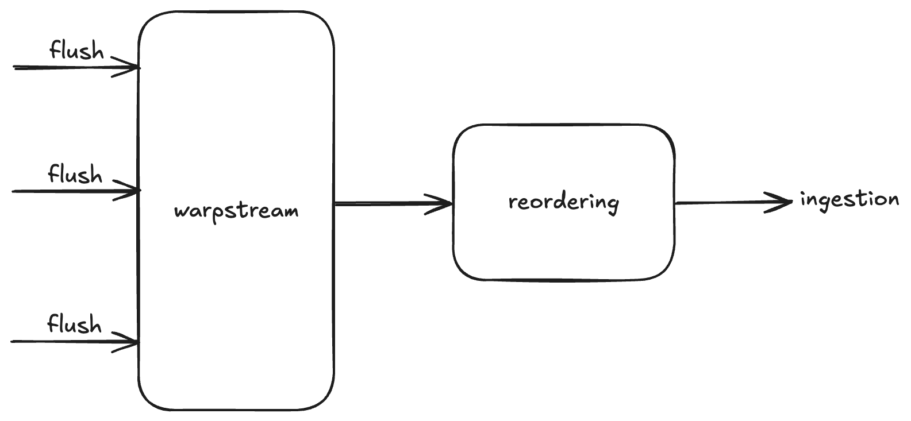

# Request for comments: Capture acknowledgements to disk

## Problem

We have a couple of potential issues with our capture service:

1. Single Point of Failure
    - Kafka is currently a single point of failure - if it goes down, we lose all events until we can failover to a new cluster (or S3)
2. Latency
    - More latency = More problems. With MSK we have a P50 around 30ms - this is good - but if we confirmed on writing to disk this could be reduced to <10ms. Having 1/3rd of the latency means 1/3rd of the connections in-flight - which means less connection errors, less memory, etc
    - With warpstream this value is _tripled_, or more without S3 express (250ms P50). Warpstream will save us huge amounts of money, and will improve reliability significantly, but comes at a cost of latency.
    - Some clients will want to fire off events synchronously which makes latency important for certain use cases (particularly e.g. lambda or serverless environments where you pay per ms)

## Solution

In the capture pods we should simply write the events to disk and return a 200 immediately, then asynchronously persist them to Kafka.

Pros:
1. Massively reduced latency - under 10ms P50 easily
2. No Single Point of Failure
   - if Kafka is down we still write events. Each pod can have a disk large enough for e.g. an hours worth of traffic, giving us time to spin up an MSK cluster, or warpstream, or whatever we can to fix things.
   - short-lived blips in Kafka are invisible to the user. e.g. patching, or a warpstream pod dying etc.

Cons:
1. Durability - durability will necessarily be reduced. There is _some_ chance of a disk failure that would lead to events we have confirmed being lost. This is extremely unlikely as disks are constantly being flushed, but it is possible. We could potentially use RAID to mitigate this.
2. Ordering - we can no longer guarantee ordering between 2 events that are sent in quick succession. A client could receive a 200 from capture, send a followup event, receive a 200 but from a different pod. These could flush out of order
3. Complexity - it's another piece of capture that can go wrong, and we need to deal with things like events getting confirmed to sqlite but failing to write to Kafka - we could have these events persisted and then debug manually at a later date.

## Proposed Architecture

I propose we add a sqlite layer to the capture service (open to other data stores, but sqlite is solid and easy to work with).

Events will be written to sqlite and we immediately return a 200 to the client.

In the background we read from sqlite and write batch to Kafka. This has additional advantages of being able to write large batches slowly, making warpstream even cheaper (e.g. we could have a linger of 1000ms, and warpstream batches of 8MB)

The sqlite database will live in a persistent volume on the capture pod - this will have a reclaim policy of **RETAIN** (important!). This means in the case of a pod dying, or the underlying node stopping responding, the persistent volume will remain untouched. We can then have a service which periodically scans for orphaned disks and flushes them to Kafka.

In the capture pod's shutdown handler we can have it flush the database and if it successfully flushes all the events it will update its volumes reclaim policy to **DELETE**, so we don't have hundreds of volumes lying around in normal circumstances.

## Optional reordering step

One thing we could do to improve ordering is to add a reordering step - this would sit between the capture topic and the rest of ingestion and buffer some duration of events (say, 20 seconds) and re-order events by capture time during this buffer, ensuring that as long as events are within a 10 second window (buffer/2) they are guaranteed to be in the correct order.

The trade off is that of course we add 20 seconds of end to end lag to the pipeline.

## Alternatives considered

We recently implemented a "fallback to S3" failure mode for capture - the idea being that if an event fails to write to Kafka we write it to S3 instead

This is more of an emergency fallback and it has significant drawbacks, especially in the case of short-lived blips or slowdowns in Kafka, where we may end up with handfuls of events in S3 that end up out of order.

Also certain failure modes will effect both Kafka and S3 (like e.g. internal networking issues), where this fallback won't help at all.