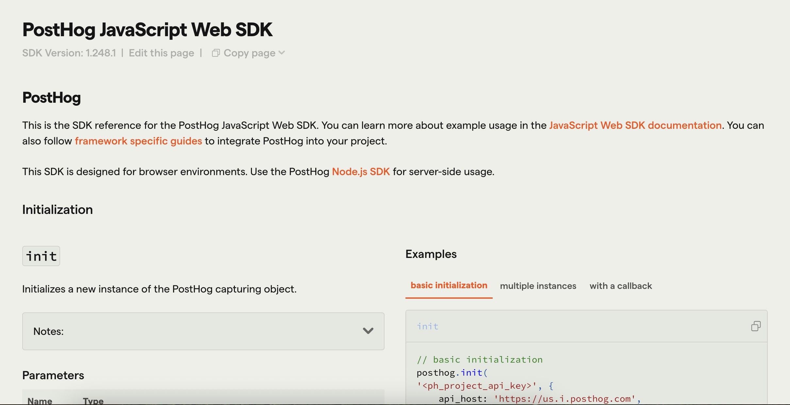
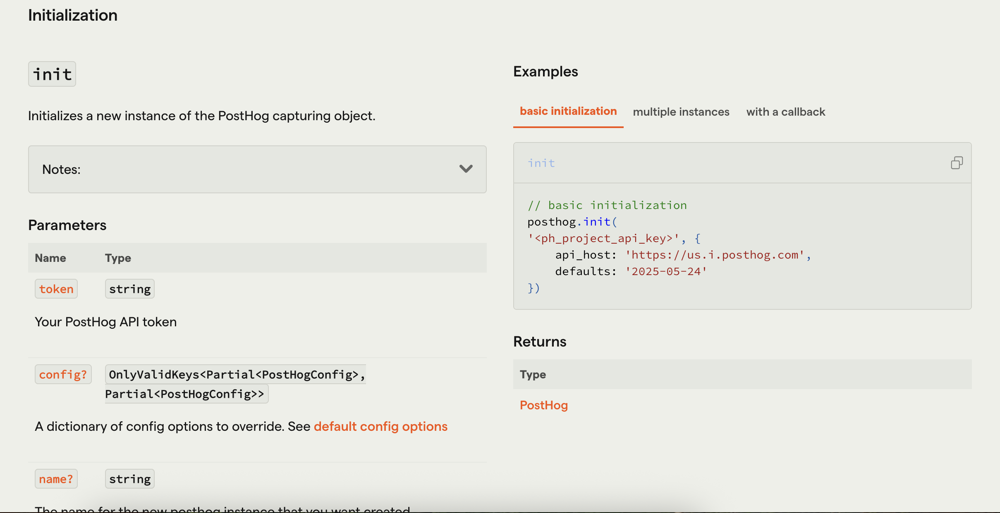
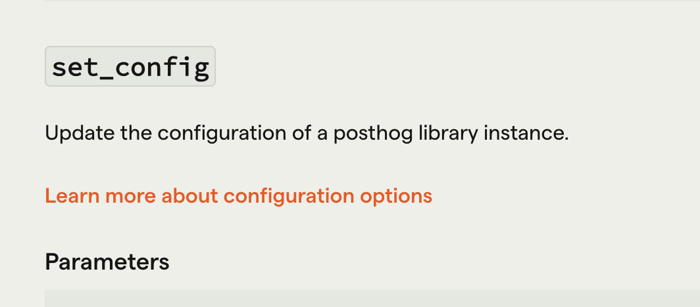
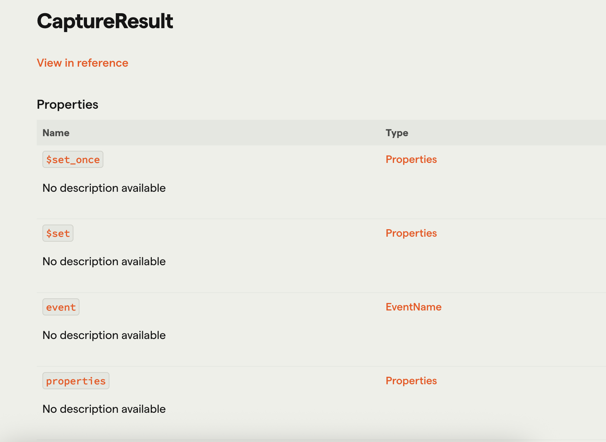

# Request for comments: SDK specs generation and reference docs

## Problem statement
We lack proper and complete specs for SDKs, APIs, events, objects, etc. This is expected of good developer tools and is more important than ever for feeding our LLM overlords correct, versioned, and up to date informations. 

This has potential to cause huge churn and debt. We can't keep chasing after fast evolving SDK versions manually.

### Why this is a problem
- Docs will frequently drift out of date.
- This causes our hand rolled SDK docs pages to be obscenely long and impossible to read. See [JavaScript Web](https://posthog.com/docs/libraries/js) and [React Native](http://localhost:8001/docs/libraries/react-native).
- Certain information like [default properties](https://posthog.com/docs/data/events#default-properties) is only available in source code.
- Without consistently formatted docs, LLMs have a harder time understanding our SDKs.

## Quick note on scope
We'll tackle generation for our most Popular SDK before tackling general Open API spec accuracy and all SDKs. Starting with PostHog JavaScript Web ofc.

## Design 
There are 3 separate problems to solve here:
1. Documenting SDKs with doc comments + generated types
2. Generating a common intermediate spec schema for all SDKs
3. Displaying the schema as reference documentation

> 💡 We're going to start with a prototype for `posthog-js`. Examples below are very specific to JavaScript Web.

### Fancy ascii graph
```
┌───────────────────────────────────────────────────────────────────────────┐
│                           SDK Source Code                                 │
│                                                                           │
│ ┌─────────────────────────┐  ┌─────────────────────────────────────────┐ │
│ │    JavaScript SDK       │  │            Other SDKs                   │ │
│ │                         │  │                                         │ │
│ │ /**                     │  │  ┌─────────────┐ ← docstrings           │ │
│ │  * Create user account  │  │  │ Python SDK  │                        │ │
│ │  * @param {string} user │  │  └─────────────┘                        │ │
│ │  * @returns {Promise<U>}│  │  ┌─────────────┐ ← JSDoc                │ │
│ │  * @example             │  │  │ Node.js SDK │                        │ │
│ │  *   createUser("alice")│  │  └─────────────┘                        │ │
│ │  */                     │  │  ┌─────────────┐ ← TSDoc                │ │
│ │ async function          │  │  │React Native │                        │ │
│ │ createUser(username) {  │  │  └─────────────┘                        │ │
│ │   return api.post(      │  │  ┌─────────────┐ ← godoc                │ │
│ │     '/users',{username} │  │  │   Go SDK    │                        │ │
│ │   );                    │  │  └─────────────┘                        │ │
│ │ }                       │  │      ...                                │ │
│ └─────────────────────────┘  └─────────────────────────────────────────┘ │
└───────────────────────────────────────────────────────────────────────────┘
                    │
                    │ Doc extraction
                    ▼
┌─────────────────────────────────────┐
│        Doc Parser/Extractor         │
│                                     │
│  • Python: docstring parser        │
│  • JavaScript: JSDoc parser        │
│  • TypeScript: TSDoc parser        │
│  • Multi-language AST analysis     │
└─────────────────────────────────────┘
                   │
                   │ Transform
                   ▼
┌─────────────────────────────────────┐
│       HogRef Schema (JSON)          │
│                                     │
│  {                                  │
│    "id": "sdk-ref-v1.2.0",          │
│    "hogRef": true,                  │
│    "info": {                        │
│      "version": "1.2.0",            │
│      "title": "PostHog SDK",        │
│      "description": "...",          │
│      "slugPrefix": "/docs/api/",    │
│      "specUrl": "..."               │
│    },                               │
│    "classes": [{                    │
│      "id": "Client",                │
│      "title": "PostHog Client",     │
│      "functions": [{                │
│        "id": "createUser",          │
│        "title": "createUser()",     │
│           ...                       |
│        "params": [{                 │
│          "name": "username",        │
│          ...                        |
│        }],                          │
│        "returnType": {              │
│          "id": "User",              │
│          "name": "User"             │
│        },                           │
│        "examples": [{               │
│          "id": "basic",             │
│          "name": "Basic usage",     │
│          "code": "client.create..." │
│        }]                           │
│      }]                             │
│    }],                              │
│    "types": [{                      │
│      "id": "User",                  │
│      "name": "User",                │
│      "path": "/types/User",         │
│      "properties": [{               │
│        "name": "id",                │
│        "type": "string",            │
│        "description": "..."         │
│      }]                             │
│    }]                               │
│  }                                  │
└─────────────────────────────────────┘
                   │
                   │ Render
                   ▼
┌─────────────────────────────────────┐
│       Gatsby GraphQL + Templates    │
└─────────────────────────────────────┘
                   │
                   │ Output
                   ▼
┌─────────────────────────────────────┐
│      Reference Documentation       │
│           Website                   │
│                                     │
│  ╔═══════════════════════════════╗ │
│  ║      createUser()             ║ │
│  ╠═══════════════════════════════╣ │
│  ║ Create a new user account     ║ │
│  ║                               ║ │
│  ║ Parameters:                   ║ │
│  ║   username (string)           ║ │
│  ║     User name to create       ║ │
│  ║                               ║ │
│  ║ Returns:                      ║ │
│  ║   User - Created user object  ║ │
│  ║                               ║ │
│  ║ [Python] [JavaScript] [Node]  ║ │
│  ║                               ║ │
│  ║ try:                          ║ │
│  ║   user = create_user("alice") ║ │
│  ║ except Exception as e:        ║ │
│  ║   print(f"Error: {e}")        ║ │
│  ╚═══════════════════════════════╝ │
└─────────────────────────────────────┘
```

### Doc comments
We'll try to use established doc comment formats where possible. For example, in the PostHog Web JavaScript, we can use [Microsoft's `tsdoc`](https://tsdoc.org/) as a relatively established and well-tooled doc comment format.

The doc comments will cover:
- Brief description of the method's purpose
- Description of parameters
- Remarks for additional details about a function's usage
- Inline examples of usage
- Category tags, like initialization, persons, feature flags, etc.
- Return signature description where applicable

Example
```ts
// Initialization methods

    /**
     * Initializes a new instance of the PostHog capturing object.
     * 
     * @remarks
     * All new instances are added to the main posthog object as sub properties (such as
     * `posthog.library_name`) and also returned by this function. [Learn more about configuration options](/docs/libraries/js/config)
     *
     * @example
     * ```js
     * // basic initialization
     * posthog.init(
     * '<ph_project_api_key>', { 
     *     api_host: '<ph_client_api_host>', 
     *     defaults: '<ph_posthog_js_defaults>' 
     * })
     * ```
     * 
     * @example
     * ```js
     * // multiple instances
     * posthog.init('<ph_project_api_key>', {}, 'project1')
     * posthog.init('<ph_project_api_key>', {}, 'project2')
     * ```
     * 
     * @public
     *
     * @param token - Your PostHog API token
     * @param config - A dictionary of config options to override. See [default config options](https://github.com/posthog/posthog-js/blob/6e0e873/src/posthog-core.js#L57-L91)
     * @param name - The name for the new posthog instance that you want created
     * 
     * {@label Initialization}
     * 
     * @returns The newly initialized PostHog instance
     */
```

This is **very similar** to what we already do, but standardizing this to be parsable will go a long way. This also ensures that when SDK code is updated, so will the specs be updated.

### Specs generated

There isn't a good standard I like. So we'll create `hogRef` inspired by [Supabase's SDK refs](https://raw.githubusercontent.com/supabase/supabase/82715efc250bd1e706491effab91968ea100479a/apps/docs/spec/supabase_dart_v2.yml).

The schema will look like this:
```yaml
id: string
hogRef: string
info:
 version: string
 id: string
 title: string
 description: string
 slugPrefix: string
 specUrl: string
classes:
 - description: string
   id: string
   title: string
   functions:
     - category: string
       description: string
       details: string
       id: string
       showDocs: boolean
       title: string
       examples:
         - code: string
           id: string
           name: string
       params:
         - description: string
           isOptional: boolean
           type: string
           name: string
       returnType:
         id: string
         name: string
types:
 - id: string
   name: string
   path: string
   properties:
     - description: string
       type: string
       name: string
```

### Reference docs pages

See video demo:

https://github.com/user-attachments/assets/52bcbc4e-7a3d-48e0-8453-15e196b6fb0f

#### SDK ref docs headers
Contains SDK versions, link to the raw references, and a copy as markdown button.


For us, SDK pages will be centered around the PostHog class.

#### Class methods
Each method will have a description parsed from the **doc comment**, a more details section from the `@remarks` block, examples from the `@example` blocks, table of parameters parsed from language type definition, augmented by `@parameter` blocks.


#### Markdown descriptions
Each will have both a description and additional collapsible notes. There will be formatted and rendered as markdown.


#### Full interface references
Each parameter or return type interface, where possible, include a reference page


#### Deprecations
Using `@deprecated` we can indicate when methods become deprecated.


#### Support for multiple examples and generated usage example
Using inline `@example` comments, we can indicate key use cases. In cases where this is not available, fall back to a templated usage example.

#### Links to source, where possible
Using links like `https://unpkg.com/posthog-js@1.248.1/lib/src/types.d.ts` we can link back to the npm package source we serve using
`unpkg.com`.

#### One-off examples, special objects, etc.
Some objects like `$event.properties` or the posthog config object don't have a good definition and we currently point to the source for these definitions. We can later augment `hogRef` to document special objects like this.

#### Categories
We will display methods by category. Init, config, and identify persons categories are always at the top. The rest sorted by product and alphabetical.

### Proposed workflow
We will automate generation, but manually version pin known-good versions to prevent breaking the website because a ref is generated in a format posthog.com can't parse.
- References are served as jsons from GitHub
- Each time a PR is merged to main, run a workflow to re-build json specs
    - for JS, this means using `api-extractor` from Microsoft and a parse script maintained by us to create `hogRef`
- Use Gatsby to fetch and build pages from version pinned jsons from GitHub
- We will manually bump sdk version pins (or list of versions) manually

## Effect on existing docs
Where possible, for each SDK doc, hand-write usage guides for set up and key use cases only. This replaces the potentially giant pages currently used to document SDKs.

## Ownership
If you update the SDK, you're expected to update the doc comment. 

## Help wanted!
Help wanted with updating doc comments: Please see the [posthog-js PR](https://github.com/PostHog/posthog-js/pull/2029) and update doc comments for your project.
