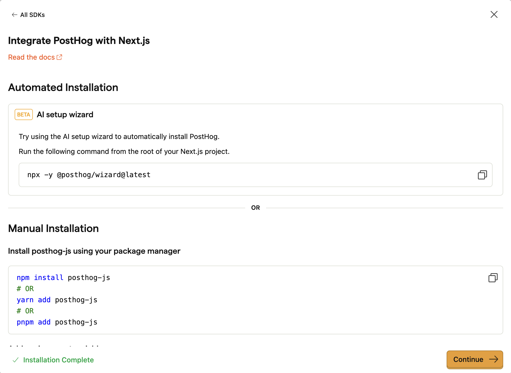
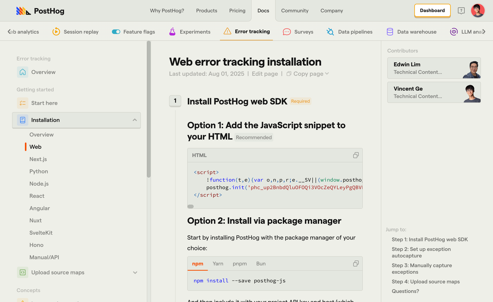

# Request for comments: Shared instructions between onboarding, wizard, and docs, Vincent Ge

## Problem statement

In app onboarding, docs, and the installation wizard share a similar set of instructions. This means we need to maintain 3 different places.

Onboarding (in app) instructions are frequently out of date compared to docs. These instructions are now important for the new installation wizards owned by the growth team.

We need a way to reduce work needed to maintain common instructions needed in three places, as well as to ensure good continuity between them.

See [contexts section](#context) to get an overview on the state of the wizard, in-app onboarding, and documentation.

## Success criteria

- Single source of truth to update getting started instructions for in-app onboarding, docs, and wizard.
- The shared instructions should be stored in a **highly readable by humans** that's also easily parsable.
- Updating instruction once should trigger updates everywhere.
- Warnings should be given when someone tries to update instructions in the wrong place (not at the source).
- Instructions should be rendered properly by onboarding, docs, and wizard. This should include minor differences, especially at checkpoints.

## Definitions

To share instructions between the wizard, in-app onboarding, and documentation, we need a **common source of truth**. 

1. For brevity, we define that common source of truth as the **"reference"** or **"ref"** for short in the below sections. 
2. For brevity, the in-app onboarding, docs, and wizard are referred to as **"consumers of the reference"** or **"consumers"**

## Design 

The problem can be broken down into these parts:
1. What format, structure, and information is stored in the ref?
2. Where is the ref stored, updated, and how are changes propagated between the wizard, in-app onboarding, and documentation?
3. How will the wizard, in-app onboarding, and documentation consume/render the ref?

### 1. Ref specifications

For all three consumers, the getting started instructions share these common features:

- Front matter (title, description)
- Stepped sections as instructions
- Each section contains a combination of text and a fixed set of components like codeblocks, images, callouts, etc.
- Checkpoints between steps

For example, in app onboarding may look like this:



And in docs.


And they differ in these areas:

- Different set of components available
    - Website uses an extended set of MDX + React components
    - In app, instructions are written directly with HTML.
- Check points instructions will be different between docs, in-app, and wizard

We can represent the instruction information as a structured reference using a markup language like TOML.

> **Why not just MDX?**
> TOML can be strictly structured and easily linted (with our own added tooling). Using more structure in the ref reduces accidental breakage. Markdown comes in many flavors, with differently implemented components across docs and app. It's easier to accidentally break things with less guardrails, and you only find out after building both docs and app.
>
> MDX snippets with react components mixed in is also much harded to read and parse for LLMs, which is important for wizards.
>
> Polluting MDX with unrendered information that's only needed in the in-app onboarding or wizard is also confusing.

We can fulfill all of these needs by describing the flow as a [toml array table](https://toml.io/en/v1.0.0#array-of-tables). You can preserve indentation of simple markdown in toml:

``````toml
# Front matter
title = "Web error tracking installation"
description = "Step-by-step guide to install PostHog web SDK for error tracking"

# Indication of steps
[[steps]]
title = "Install PostHog web SDK"
badge = "required"

# Indication of step content
[[steps.content]]
type = "markdown"
content = """
## Option 1: Add the JavaScript snippet to your HTML Recommended

```sh
npm install --save posthog-js
```
"""

[[steps]]
# ... more steps
``````

This is the equivalent of the following JSON (much less readable):

```json
{
  "description": "Step-by-step guide to install PostHog web SDK for error tracking",
  "title": "Web error tracking installation",
  "steps": [
    {
      "badge": "required",
      "title": "Install PostHog web SDK",
      "content": [
        {
          "content": "## Option 1: Add the JavaScript snippet to your HTML Recommended\n\n```sh\nnpm install --save posthog-js\n```\n",
          "type": "markdown"
        }
      ]
    },
    {
        ... more steps
    }
  ]
}
```

> The majority of content will be these markdown blocks. This helps retain readability, and keeps th

We can define a strict set of content blocks available. The rendering logic is similar to markdown:

- MDX in the docs consists of a series of linearly rendered blocks separated by nextlines, extended by special blocks of react components.
- Our TOML spec can also be a series content blocks, which are a mix of standard markdown and components.

#### Custom components

``````toml
[[steps]]
title = "Install PostHog web SDK"
badge = "required"

# Indication of step content
[[steps.content]]
type = "markdown"
content = """
## Option 1: Add the JavaScript snippet to your HTML Recommended
"""

# Indication of some custom component
[[steps.content]]
type = "calloutbox"
icon = "IconWarning"
title = "Don't `rm -rf ~/`"
type = "warning"
content = """
You should never run `rm -rf ~/`, it will blow up your computer.
"""
``````

The above will be the equivalent of the following MDX:

``````md
## Option 1: Add the JavaScript snippet to your HTML Recommended

```sh
npm install --save posthog-js
```

<CalloutBox icon="IconWarning" title="Don't `rm -rf ~/`" type="warning">

You should never run `rm -rf ~/`, it will blow up your computer.

</CalloutBox>
``````

#### Render different content for each consumer

```toml
[[steps]]
title = "Verify PostHog is initialized"
subtitle = "Confirm you can capture events with PostHog"
type = "checkpoint"
badge = "checkpoint"

# Wizard specific instructions
[[steps.content.wizard]]
type = "Instruction"
content = """
Before proceeding, run `curl -X GET 'https://app.posthog.com/api/projects/{project_id}/events?event=test_event&after=2025-09-03T00:00:00Z' -H 'Authorization: Bearer {personal_api_key}'Retry`  
"""

[[steps.content.wizard]]
type = "prompt"
content = """
Before proceeding, run `curl -X GET 'https://app.posthog.com/api/projects/{project_id}/events?event=test_event&after=2025-09-03T00:00:00Z' -H 'Authorization: Bearer {personal_api_key}'Retry`  
"""

# Show if event is received in app
[[steps.content.app]]
type = "live"
event = "SOME_EVENT_TO_AWAIT"

# Catch all
[[steps.content]]
type = "markdown"
content = """
Before proceeding, confirm that you can capture events with PostHog using `posthog.capture('test_event')`.
"""
```

See [rendering the ref](#3-consuming-the-ref) for more on how these blocks are rendered

### 2. How is the ref stored and updated

The ref will be stored as a structured markup language in the **docs repo**. We will update it in the docs repo as the sole source of truth. Ownership would also be clearer here.

TOML is a great choice, fitting the criteria below:

- Distinct, nestable structure that's easy to build tooling and linting around.
- Does not rely on excessive closures with `{}` `()` `[]` that make it hard to read
- Preserves next lines (`\n`) and indentations.
- Allows definitions of _props_, like those commonly found on a component. Think `<tag prop1="some value" prop2="some value"/>`. These are needed to represent components like `<CodeBlock>`, `<CalloutBox>`, `<Steps>` that are implemented differently across consumers.

> 🤔 Point of discussion: When should app, docs, wizard pull in updated instructions?
> 
> - Before build through GitHub Actions and automated PRs triggered when any of the refs are updated. Requires most manual work, but safe and lets us catch problems.
> - During build by fetching from `posthog/posthog.com/master`. Less manual, requires redeploy to update, could break/block people's builds
> - At run time. Always up to date. Could break without us knowing.

We can set up checks/warnings in the PostHog monorepo and wizard repos to warn contributors if they update directly in those repos.


### 3. Consuming the ref

The ref can be loaded into code as an object and conditionally rendered on the website and docs.

Both app and website suport `ReactMarkdown` (in app it's `LemonMarkdown`). This means `markdown` blocks can be rendered directly. 

Extended blocks can be rendered using their respective components.

For example:

```jsx
 {blocks.map((block, index) => {
    switch (block.type) {
        case 'markdown': {
            const processedMarkdown = renderPostHogComponents(block.inner_md)
            return (
                <div key={index} className="prose max-w-none">
                    <ReactMarkdown>
                        {block.content}
                    </ReactMarkdown>
            )
        }
        case '...': 
    ...
```

And when consumed by the wizard, each block's content can be fed in as a prompt.

> 🤔 Point of discussion: Should we turn refs into jsx/mdx files at build time for docs and app?
> 
> - Option 1: Syncing with automated PRs after the refs are updated. Safest, lets us review, but needs multiple PR reviews and redeploys.
> - Option 2: Building mdx/jsx using SSG (server side generation) during app/website build. Is simple/safe, but requires redeploys
> - Option 3: Fetch/cache the ref to render at run time. Requires no reployment/PR reviews to propagate changes, but can break prod. 

Alternatively, we could go from ref -> mdx/jsx files directly using some simple tooling. This is potentially confusing because people will try to update the generated mdx/jsx files directly.

## Sprints

TBD. Likely planned as a goal for Q4.

## Context

Here's some context on existing sources that could consume these shared instructions.

### Existing stepped installation

We moved to strongly structured, stepped, linear [installation instructions](https://posthog.com/docs/error-tracking/installation/web) in docs. These instructions have clear steps and checkpoint concepts to check if each step is successful.

This offers readers clear checkpoints, sense of "quick wins", and clear goals during the most uncertain stages of their onboarding.

These concepts happen to also be important for the wizard, and allow future features like real-time feedback (like if events have been received). 

### In-app onboarding

When you sign up to PostHog, you're show in-app onboarding instructions. These are critical to smooth onboarding for self-serve customers.

In-app onboarding in theory should be able to map to docs 1:1, you should be able to pick up where you left off in-app and follow in docs. The instructions should also be non-conflicting.

The instructions in-app don't have clear ownership, and are often out of date. Their upside is real-time feedback on if events have been received.

### Wizard

PostHog has LLM-powered wizards to help you integrate with PostHog SDKs. These need some accurate source of truth to know how to integrate correctly. They also need more structured checkpoints, to self-check for integration correctness.

Their current challenges are occassional hallucinations, staying up to date with latest changes, and lack of self-checking mechanisms to see if changes made are working currectly.